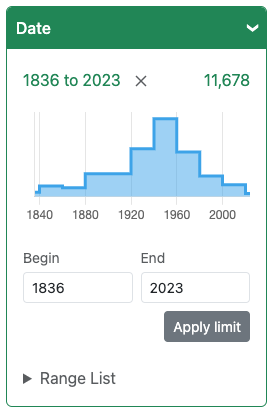

BlacklightRangeLimit:  integer range limiting and profiling for Blacklight applications

 [](http://badge.fury.io/rb/blacklight_range_limit)



# Description

The BlacklightRangeLimit plugin provides a 'facet' or limit for integer fields, that lets the user enter range limits with a text box or a slider, and also provides area charts giving a sense of the distribution of values (with drill down).

The primary use case of this plugin is for 'year' data, but it should work for any integer field.

Decimal numbers and Dates are NOT supported; they theoretically could be in the future, although it gets tricky.


# Requirements

* A Solr integer field. It might be advantageous to use an IntPointField.

* Javascript requires you to be using either rails-importmaps or a package.json-based builder like jsbundling-rails or vite-ruby.  Legacy "sprockets-only" is not supported, however propshaft or sprockets can be used as your base asset pipeline.

* Blacklight 7.0+.  Rails 7.0+


# Installation

Add

    gem "blacklight_range_limit"

to your Gemfile. Run `bundle install`.

Run `rails generate blacklight_range_limit:install`

### Manual Javascript setup is not hard

The installer could have trouble figuring out how to add Javascript to your particular setup. If it's not working right and you want the installer to skip asset generation, you can execute as `rails generate blacklight_range_limit:install --skip-assets`.


In the end, all you need is `blacklight-range-limit` either importmap-pinned (with its chart.js dependency), or added to your package.json, and then, in a file that has access to the `Blacklight` import:

    import BlacklightRangeLimit from "blacklight-range-limit";
    BlacklightRangeLimit.init({ onLoadHandler: Blacklight.onLoad });

A package.json might include:

```
"blacklight-range-limit": "^9.0.0",
```
(direct to git references also supported in package.json)

importmap.rb pins might look like:

```
pin "chart.js", to: "https://ga.jspm.io/npm:chart.js@4.2.0/dist/chart.js"
pin "@kurkle/color", to: "https://ga.jspm.io/npm:@kurkle/color@0.3.2/dist/color.esm.js"
```

For import map pins, note:
* The standard "locally vendored" importmap-rails setup is not working with chart.js at the time of this writing, so you need to pin to CDN as above.
* versions in importmap pins will have to be updated manually if you want to upgrade.

### Unreleased version?

If you'd like to use an unreleased version from git, just add that to your Gemfile in the usual way.

importmap-rails use should then Just Work.

package.json-based use will additionally need to point to the matching unreleaesd version in git in package.json, eg `yarn add blacklight-range-limit@git+https://github.com/projectblacklight/blacklight_range_limit.git#branch_name_or_commit_sha`. Still simple.


# Facet Configuration

You have at least one solr field you want to display as a range limit, that's why you've installed this plugin. In your CatalogController, the facet configuration should look like:

```ruby
config.add_facet_field 'pub_date', label: 'Publication Year', range: true
```

You should now get range limit display. More complicated configuration is available if desired, see Range Facet Configuration below.

## A note on AJAX use

In order to calculate distribution segment ranges, we need to first know the min and max boundaries. But we don't really know that until we've fetched the result set (we use the Solr Stats component to get min and max with a result set).

So, ordinarily, after we've gotten the result set, an additional round trip to back-end and solr will happen, with min max identified, to fetch segments.

If you'd like to avoid this, you can set :assumed_boundaries below to use fixed boundaries for not-yet-limited segments instead of taking boundaries from the result set. Or you can disable the segment behavior by setting `chart_js` and `textual_facets` both to false.

Note that a drill-down will never require the second request, because boundaries on a drill-down are always taken from the specified limits.


## Range Facet Configuration

There are some additional configuration options that can be passed in facet config in the `range_config` key. You can pass some or all of them like this:

```ruby
config.add_facet_field 'pub_date', label: 'Publication Year', range_config: {
       num_segments: 6,
       assumed_boundaries: [1100, Time.now.year + 2],
       segments: true,
       chart_js: true,
       textual_facets: true,
       textual_facets_collapsible: true,
       show_missing_link: true,
       chart_segment_border_color: "rgba(0,0,0, 0.5)",
       chart_segment_bg_color: "#ccddcc",
       chart_aspect_ratio: "2"
}
```

* **:num_segments** :
  * Default 10. Approximately how many segments to divide the range into for segment facets, which become segments on the chart. Actual segments are calculated to be 'nice' values, so may not exactly match your setting.
* **:assumed_boundaries** :
  * Default null. For a result set that has not yet been limited, instead of taking boundaries from results and making a second AJAX request to fetch segments, just assume these given boundaries. If you'd like to avoid this second AJAX Solr call, you can set :assumed_boundaries to a two-element array of integers instead, and the assumed boundaries will always be used. Note this is live ruby code, you can put calculations in there like Time.now.year + 2.
* **chart_js**:
  * Default true. If false, the Javascript chart is not loaded, you can still get textual facets for bucket with `textual_facets` config.
* **textual_facets**:
  * Default true. Should we show textual facet list too? Universal design
  for accessibility, may have accessibilty concerns to turn off.
* **textual_facets_collapsible**:
  * Put the textual facets in a collapse/expand
  disclosure. If you set chart_js to false, may make sense to set this to false too, to have
  textual facets only instead of chart?
* **show_missing_link**:
  * Default true. Display a link (with count) to results that are _missing_ a value for the range field.
* **chart_segment_border_color** / **chart_segment_bg_color**:
  * Set colors for the edge and fill of the segment bars in the histogram.
* **chart_aspect_ratio**:
  * Defaults to 2. For chart.js, will fill available width then this determines size of chart.

## Javascript dependencies

We use [chart.js](https://www.chartjs.org/) to draw the chart. It has one dependency of its own. These need to be either pinned with importmap-rails, or used via the chart.js npm package and an npm-package-based bundler.

There is **no CSS** needed.

## Upgrading from blacklight-range-limit 8.x to 9.x

All back-end configuration should be backwards compatible.

You will need to change how you load JS. (There is no longer any blacklight_range_limit CSS to load).

You will need to be using either importmap-rails or a package.json-based javascript bunder (jsbundling-rails or vite) to deliver JS to your app. Legacy sprockets-only is not supported.

Then, remove ALL existing (sprockets) references to blacklight_range_limit in your JS or CSS pipelines.

And run `rails g blacklight_range_limit:assets` -- or manually set up the JS for unusual setups (such as vite-rails), see above at <a href="#installation">Installation</a>.

For an unreleased version from git -- the installer is not presently capable of installing
that, but simply add the unreleased version of the gem to your Gemfile.


# Tests

Test coverage is not great, but there are some tests, using rspec.  Run `bundle exec rake ci` or just `bundle exec rake` to seed and
start a demo solr server, build a clean test app, and run tests.

Just `bundle exec rake spec` to just run tests against an existing test app and solr server.

## Local Testing
If you want to iterate on a test locally and do not want to rebuild the
required test environment every time you run the test you can set up the
required server by first running:
```bash
bundle exec rake test:server
```

Now from another shell run your individual test as needed:
```bash
bundle exec rspec spec/features/blacklight_range_limit_spec.rb
```

Once you are done iterating on your test you will need to stop the application server with `Ctrl-C`.

# Publishing Javascript

run `npm publish` to push the javascript package to https://npmjs.org/package/blacklight-range-limit
